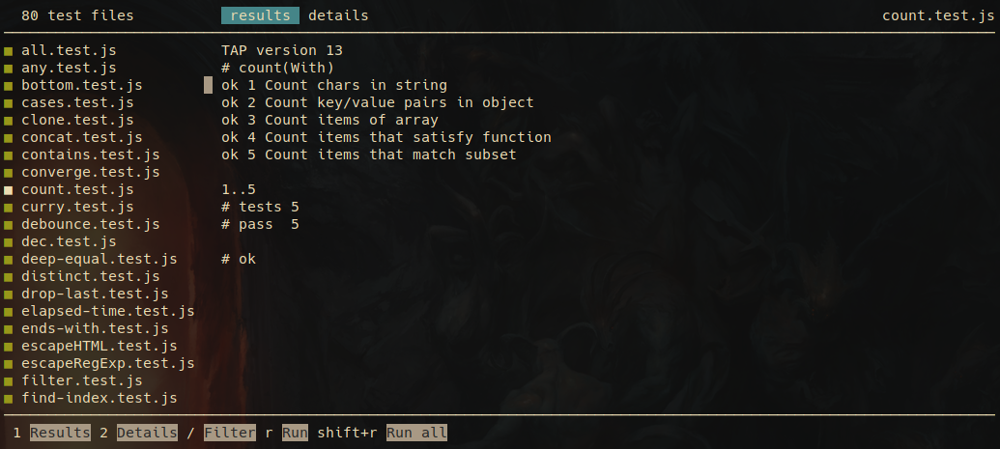

<!-- markdownlint-disable first-line-h1 line-length -->

[](https://circleci.com/gh/mutant-ws/tape-ui/tree/master)
[](https://badge.fury.io/js/%40mutant-ws%2Ftape-ui)

# WIP: Tape UI



---

<!-- vim-markdown-toc GFM -->

* [Features](#features)
* [Install](#install)
* [Use](#use)
* [Develop](#develop)
* [Changelog](#changelog)

<!-- vim-markdown-toc -->

## Features

* [ ] Run only relevant tests based on file changes

## Install

```bash
npm install tape-ui
```

## Use

Add script in `package.json`

```json
{
  "scripts": {
    "tdd": "tape-ui -r @babel/register 'src/**/*.test.js'",
  }
}
```

## Develop

```bash
git clone git@github.com:andreidmt/tape-ui.git && \
  cd tape-ui && \
  npm run setup

# run tests (any `*.test.js`) once
npm test

# watch `src` folder for changes and run test automatically
npm run tdd
```

## Changelog

See the [releases section](https://github.com/andreidmt/tape-ui/releases) for details.
