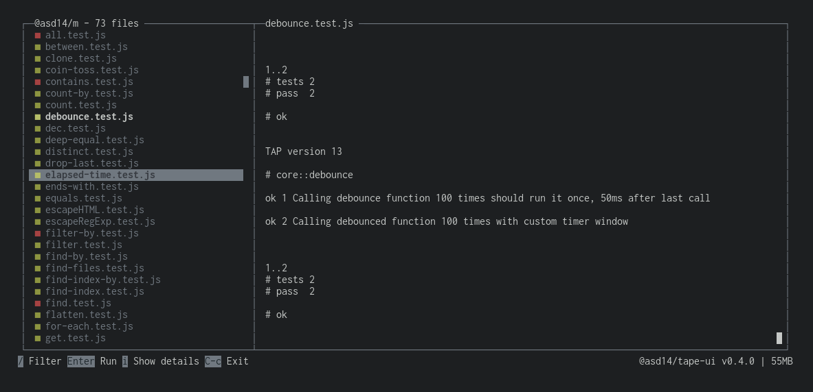

<!-- markdownlint-disable first-line-h1 line-length -->

[](https://circleci.com/gh/mutant-ws/tape-ui)
[](https://badge.fury.io/js/%40mutant-ws%2Ftape-ui)

# WIP: Tape UI

> Terminal UI for [Tape](https://github.com/substack/tape) test runner



---

<!-- vim-markdown-toc GFM -->

* [Features](#features)
* [Install](#install)
* [Use](#use)
* [Develop](#develop)
* [Commit messages](#commit-messages)
* [Changelog](#changelog)

<!-- vim-markdown-toc -->

## Features

* [ ] Terminal UI with VIM shortcuts - [neo-blessed](https://github.com/embarklabs/neo-blessed) and [react-blessed](https://github.com/Yomguithereal/react-blessed)
* [ ] Test files run in separate workers
* [ ] Auto run only relevant tests based on file changes

## Install

```bash
npm i --save-exact @mutant-ws/tape-ui
```

## Use

Add script in `package.json`

```json
{
  "scripts": {
    "tdd": "tape-ui -r @babel/register -p src -g '**/*.test.js'",
  }
}
```

## Develop

```bash
git clone git@github.com:mutant-ws/tape-ui.git && \
  cd tape-ui && \
  npm run setup

# run tests (any `*.test.js`) once
npm test

# watch `src` folder for changes and run test automatically
npm run tdd
```

## Commit messages

Using Angular's [conventions](https://github.com/angular/angular.js/blob/master/DEVELOPERS.md#-git-commit-guidelines).

```text
<type>(<scope>): <subject>
<BLANK LINE>
<body>
<BLANK LINE>
<footer>
BREAKING CHANGE: Half of features not working anymore
```

* **feat**: A new feature
* **fix**: A bug fix
* **docs**: Documentation only changes
* **style**: Changes that do not affect the meaning of the code (white-space, formatting, missing semi-colons, etc)
* **refactor**: A code change that neither fixes a bug nor adds a feature
* **perf**: A code change that improves performance
* **test**: Adding missing or correcting existing tests
* **chore**: Changes to the build process or auxiliary tools and libraries such as documentation generation

## Changelog

See the [releases section](https://github.com/mutant-ws/tape-ui/releases) for details.
